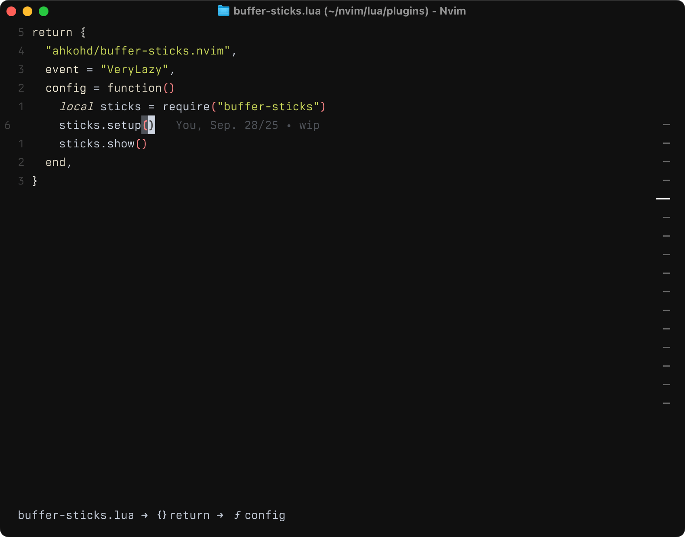

# buffer-sticks.nvim

A minimal Neovim plugin that displays a vertical indicator showing open buffers.



## Features

- Visual representation of open buffers
- Highlights the currently active buffer
- Configurable positioning and appearance
- Transparent background support
- Persists highlight configuration across colorscheme changes

## Installation

Using [lazy.nvim](https://github.com/folke/lazy.nvim):

```lua
{
  "ahkohd/buffer-sticks.nvim",
  config = function()
    require("buffer-sticks").setup()
  end,
}
```

Using [packer.nvim](https://github.com/wbthomason/packer.nvim):

```lua
use {
  "ahkohd/buffer-sticks.nvim",
  config = function()
    require("buffer-sticks").setup()
  end
}
```

## Configuration

```lua
require("buffer-sticks").setup({
  position = "right",           -- "left" or "right"
  width = 3,                    -- Width of the floating window
  offset = { x = 0, y = 0 },    -- Position offset
  active_char = "──",           -- Character for active buffer
  inactive_char = " ─",         -- Character for inactive buffers
  transparent = true,           -- Transparent background
  -- winblend = 100,                 -- Window transparency (0-100, overrides transparent)
  -- filter = {
  --   filetypes = { "terminal" },    -- Exclude terminal buffers (also: "NvimTree", "help", "qf", "neo-tree", "Trouble")
  --   names = { ".*%.git/.*", "^/tmp/.*" },  -- Exclude buffers matching lua patterns
  -- },
  highlights = {
    active = { fg = "#ffffff" },
    inactive = { fg = "#666666" }
  }
})
```

## Usage

```lua
-- Toggle visibility
require("buffer-sticks").toggle()

-- Show
require("buffer-sticks").show()

-- Hide
require("buffer-sticks").hide()

-- Or use the command
:BufferSticks
```

### Highlight Options

You can use hex colors:

```lua
highlights = {
  active = { fg = "#ffffff" },
  inactive = { fg = "#666666" }
}
```

Or link to existing highlight groups:

```lua
highlights = {
  active = { link = "Statement" },
  inactive = { link = "Comment" }
}
```

## API

- `setup(opts)` - Initialize the plugin with configuration
- `toggle()` - Toggle buffer sticks visibility
- `show()` - Show buffer sticks
- `hide()` - Hide buffer sticks
